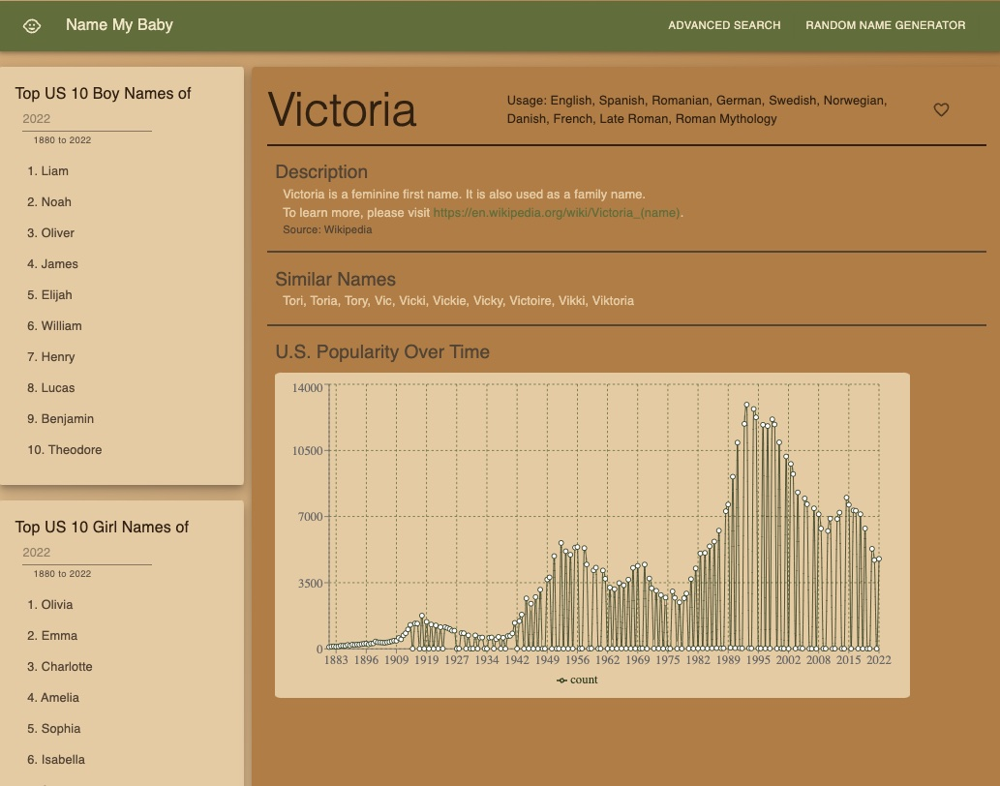

# 👶 Name My Baby
### For indecisive parents who have been calling their baby 'it'

## 🔍 Overview ##
This easy-to-use app is designed for expectant parents who want to choose a unique, meaningful name for their child without being overwhelmed by all the options out there.

## 📝 Summary ##
As soon as you make your pregnancy announcements, the first question friends and family will ask you is "Any names?". You're tired of saying, "Not yet," but you're also too busy to put in the time to think of a name. Name My Baby is designed to make this decision easy by generating a random baby name for you! Simply select a gender to get started.

## Use this app instead of calling your baby "it". ##

## 🚀 How to Get Started ##
Visit the website and randomly generate a name to see facts about the name, similar names, and how many babies in the US were given that name between ancient history and 2022. You can also search for the top 10 boy and girl names in the US for each year since the US started collecting census records.

## 💬 Customer Quote ##
"A simple design without the shilling and the ads." - anonymous

## Don't wait! Name your baby today! ##

## Future Features ##
- Advanced Search for Baby Names
- Favorites List

## 👩‍💻 For Developers ##
1. 🔧 git clone NameMyBaby repository
2. In CLI, cd to the repository and run 'npm install'.
3. 🔑 Create a .env file in the root directory. Make sure to define PORT and DATABASE_URL variables.
4. In CLI, run "npm run start".